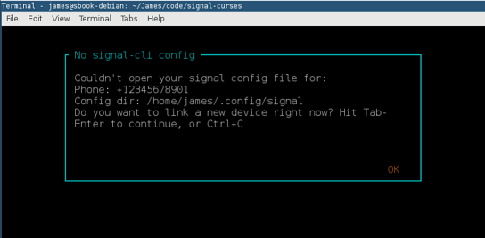
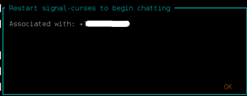
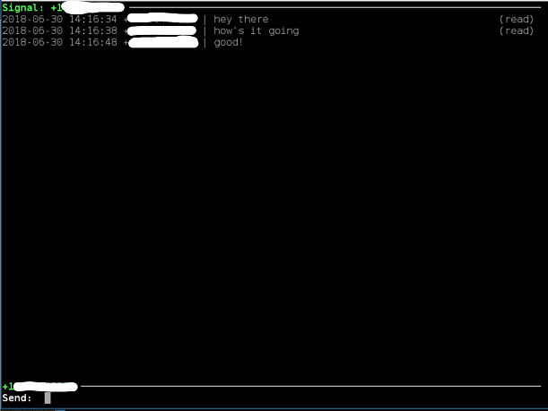
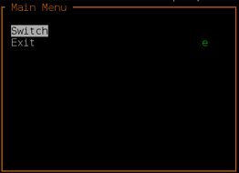

# signal-curses
Curses-backed terminal interface for [Signal](https://signal.org) using [signal-cli](https://github.com/AsamK/signal-cli) and [npyscreen](https://github.com/npcole/npyscreen).

Setup
=====
* Install [signal-cli](https://github.com/AsamK/signal-cli) (see [Installation](https://github.com/AsamK/signal-cli/blob/master/README.md#installation)). Because signal-curses depends on JSON output features, only versions of signal-cli >= 0.6.1 will work.
* Install [libunixsocket-java](https://packages.debian.org/libunixsocket-java) (see [DBus service](https://github.com/AsamK/signal-cli/wiki/DBus-service))
* Install [pydbus](https://github.com/LEW21/pydbus) dependencies, if needed (see [Requirements](https://github.com/LEW21/pydbus/blob/master/README.rst))
* Install python deps with ```pip install -r requirements.txt```
* Run with ```python3 main.py -u '+12345678901'```, giving your Signal phone number with country code (e.g. +1)
* If signal-cli has not been run before, you will be prompted to link your phone with your computer. Scan the given terminal QR code in the Signal app under Settings > Linked Devices, and restart signal-curses. Your contacts and groups should appear, and you should be able to send messages.

Screenshots
===========




Setup dialog


Link dialog



Setup finished message


User and group list



In-message UI



Ctrl-X menu
